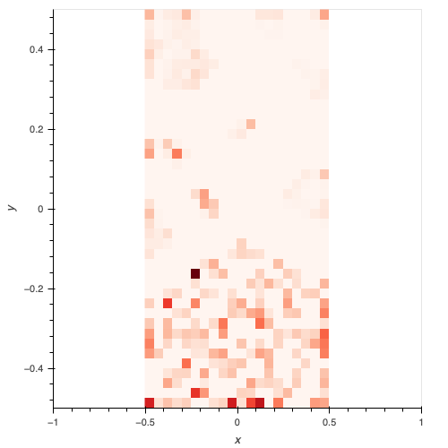
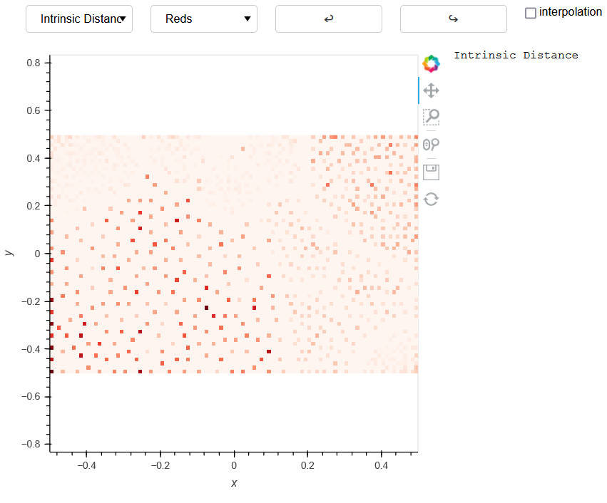

# Self Organizing Systems WS2021 Exercise 3: Group Coding Topic c1
Group Coding Topic c1
Members
- Preinsperger Christopher, e01529038
- Maliakel Paul Joe, e12012422
- Kowarsch Florian, e11777780

GitHub: [https://github.com/ChrisPrein/TUW_SelfOrganizingSystems_WS2021](https://github.com/ChrisPrein/TUW_SelfOrganizingSystems_WS2021)

---

For the evaluation of the Topographic error and intrinsic distance implementations we have used two datasets and two sizes of SOM. (40x20 -small and a 100x60 - large)

The first dataset (left visualization below) is the so called chain link data set that contains two two-dimensional rings which are intertwined in a three-dimensional space.

The second dataset (right visualization below) is the so called 10 clusters dataset. The clusters were generated from 10-dimensional gaussian distributions with different densities. 

Chainlink dataset          |  Clusters dataset
:-------------------------:|:-------------------------:
 | 

## Chain Link Dataset 40x20

A minisom som is trained with sigma=7, learning_rate=0.7 and iterations=1000000 using the chainlink dataset. We produce Topographic error visualisation with parameters 4 unit and 8 unit neighborhoods and an intrinsic distance visualisation.

Topographic error 4 unit neighborhood             |  Topographic error 8 unit neighborhood
:-------------------------:|:-------------------------:
 | 

For the above visualizations, we trained the som with sigma=7, learning_rate= 0.7 and with 1000000 iterations
The 4-unit neighborhood approach of the topographic error 
shows the topology violations in dense cluster areas and it forms the 
two rings more clearly compared to the 8 unit neighborhood.

We tried with 5000 iterations it gives almost the same result as above visualisations.

Intrinsic distance  |           
:-------------------------: |
 |

The intrinsic distance implementation yields good results as we can see its form a ring

## Chain Link Dataset 100x60

A minisom som is trained with sigma=6, learning_rate=0.7 and iterations=500000 using the chainlink dataset. We  produce a Topographic error visualisation with parameters 4 unit and 8 unit neighborhoods and an intrinsic distance visualisation.

Topographic error 4 unit neighborhood             |  Topographic error 8 unit neighborhood
:-------------------------:|:-------------------------:
 | 

Here we can see more violations compared to the 40x20 case.

Increasing the size of the SOM would not yield better results. The visualization is quite the contrary as we do observe in the previous case. Increasing the number of training iterations and "playing" with the training parameters would in general not improve the results.

Intrinsic distance  |           
:-------------------------: |
  |

## Cluster Dataset 40x20

A minisom som is trained with sigma=7, learning_rate=0.7 and iterations=1000000 using the clusters dataset. We produce two Topographic error visualisations with parameters 4 unit and 8 unit neighborhoods and an intrinsic distance visualisation.

Topographic error 4 unit neighborhood|  Topographic error 8 unit neighborhood
:-------------------------:|:-------------------------:
 | 

The topographic error visualisation of the 10cluster dataset shows the topology violations. We can see from 
4 unit neighborhood the violations in the clusters are shown by the visualisation and we can see
some clusters forming in the visualisation.

We also tried with 5000 iterations and result look almost the same.So increasing the iterations does not show much improvement.

Intrinsic distance  |           
:-------------------------: |
 |

The intrinsic distance visualisation of the cluster dataset clearly shows all the 10 clusters.

## Cluster Dataset 100x60

A minisom som is trained with sigma=7, learning_rate=0.7 and iterations=500000 using the clusters dataset. We produce two Topographic error visualisations with parameters 4 unit and 8 unit neighborhoods and an intrinsic distance visualisation.

Topographic error 4 unit neighborhood |  Topographic error 8 unit neighborhood
:-------------------------:|:-------------------------:
 | 

The pattern of topology violations we see in the 100x60 som is different compared to the 40x20. Whereas in the above case we could clearly
see the violations as clusters.

Intrinsic distance  |           
:-------------------------: |
 |

The intrinsic distance visualisation of the cluster dataset 100x60 is different compared to the 40x20
because in the 40x20 case we could clearly see the 10 clusters but here as the size of the map increases the 
pattern of the clusters we get in the first case is not visible.

# Comparison with Java SOMToolbox

We are comparing the visualisations created in the java som toolbox with visualisation created in our python implementation from the pretrained soms. We are using both cluster dataset and chainlink dataset

## cluster dataset

The parameters we used for the training the som are sigma=6, learning_rate=0.7, iterations=500000, xdim=100,ydim=60

Topographic error 4 unit neighborhood (implementation) |  Topographic error 8 unit neighborhood (implementation)  |
:-------------------------:|:-------------------------:|
 |  | 

Topographic error 4 unit neighborhood (SOM Toolbox)  |  Topographic error 8 unit neighborhood (SOM Toolbox)
:-------------------------:|:-------------------------:
  |   

|            Intrinsic distance (implementation)       |   Intrinsic distance (SOM Toolbox)   |
:-------------------------:|:-------------------------:
 |   

## chainlink dataset

The parameters we used for the training the som are sigma=6, learning_rate=0.7, iterations=500000, xdim=40,ydim=20

Topographic error 4 unit neighborhood (implementation)  |  Topographic error 8 unit neighborhood (implementation)
:-------------------------:|:-------------------------:
 | 

Topographic error 4 unit neighborhood (SOM Toolbox) |  Topographic error 8 unit neighborhood (SOM Toolbox)  |
:-------------------------:|:-------------------------:|
 | 

| Intrinsic distance (implementation) | Intrinsic distance (SOM Toolbox)|
:-------------------------:|:-------------------------:
 |   

The visualisation from Java Som Toolbox and our python implementation look the same for both Topographic error and intrinsic distance which confirms our implementations are correct.

## Adapted Approach for Topographic Error

Since the topographic error displays the total number of input vectors that do not have their second best matching unit in their neighborhood, it is more likely for dense units to have a high topographic error. Strictly speaking dense units are likely to have a higher topographic error even if only a small percentage of it's input vectors produce an error. We therefore tried an alternative approach for computing the topographic error, which normalizes the error by the number of mapped input vectors.
The following plot compares the HitHistogram, default Topographic Error with 4 unit neighborhood and our percentage Topographic Error with 4 unit neighborhood on the above Chainlink 40x20 SOM. Note that while the same Units are marked, the color often varies drastically between both approaches, since the percentage approach strongly penalizes units that have only a few mappings but all with topology violations.
